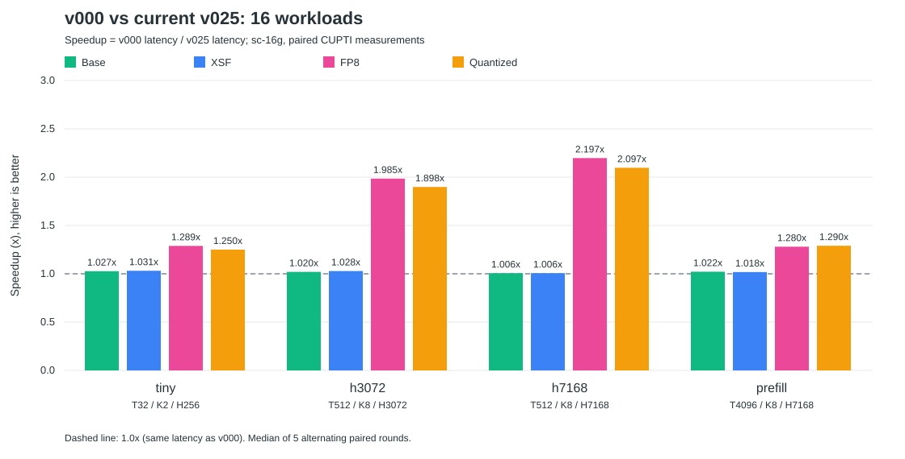

# v026：v000 与当前 v025 的 16 组性能总结

## 比较范围

本次在同一 sc-16g 实例重新配对测量全部16组，不拼接历史轮次。

- **v000**：最初迁移的 naive kernel，Git `ffc084d9`；每个token一个CTA，128线程，FP8使用SDK转换。
- **当前 v025**：正式kernel，Git `7f3b4c92`，包含截至v025所有已接入优化。
- tiny为T32/K2/H256、FP16；其余为BF16：h3072=T512/K8/H3072，h7168=T512/K8/H7168，prefill=T4096/K8/H7168。
- 四变体均使用top-k权重；XSF增加输入行缩放，FP8增加最终sf并输出E4M3，Quantized同时使用两个缩放。

## 16 组 workload 对比

**加速比 = v000耗时 ÷ v025耗时**；耗时下降 = (1 − v025耗时 ÷ v000耗时) × 100%。加速比大于1表示变快。



| 变体 | workload | v000 μs | 当前v025 μs | 加速比 | 耗时下降 |
|---|---|---:|---:|---:|---:|
| Base | tiny | 3.712 | 3.615 | 1.027× | 2.62% |
| Base | h3072 | 21.233 | 20.818 | 1.020× | 1.95% |
| Base | h7168 | 44.452 | 44.175 | 1.006× | 0.62% |
| Base | prefill | 360.310 | 352.701 | 1.022× | 2.11% |
| XSF | tiny | 3.707 | 3.594 | 1.031× | 3.04% |
| XSF | h3072 | 21.320 | 20.731 | 1.028× | 2.76% |
| XSF | h7168 | 44.641 | 44.360 | 1.006× | 0.63% |
| XSF | prefill | 361.011 | 354.627 | 1.018× | 1.77% |
| FP8 | tiny | 4.823 | 3.743 | 1.289× | 22.40% |
| FP8 | h3072 | 41.994 | 21.156 | 1.985× | 49.62% |
| FP8 | h7168 | 94.684 | 43.090 | 2.197× | 54.49% |
| FP8 | prefill | 428.344 | 334.515 | 1.280× | 21.91% |
| Quantized | tiny | 4.710 | 3.768 | 1.250× | 20.00% |
| Quantized | h3072 | 42.378 | 22.323 | 1.898× | 47.32% |
| Quantized | h7168 | 94.403 | 45.015 | 2.097× | 52.32% |
| Quantized | prefill | 434.877 | 337.004 | 1.290× | 22.51% |

## 结论与当前采用的优化

- **Base**：四组加速比范围 1.006～1.027×。
- **XSF**：四组加速比范围 1.006～1.031×。
- **FP8**：四组加速比范围 1.280～2.197×。
- **Quantized**：四组加速比范围 1.250～2.097×。

最大加速来自 **FP8 / h7168：2.197×**。Base/XSF只有线程配置等调整，小幅差异仍可能包含运行波动；FP8/Quantized还包含编码、分块、grid、写回和预取优化。本次是累计效果对照，不能从这张表单独分摊每项优化的收益。

| 已采用方法 | 当前使用范围 |
|---|---|
| v003：FP32/整数直接编码E4M3，避开SDK FP64路径 | FP8/Quantized |
| v004＋v007/v009/v010：hidden分块与实测tile/threads选择 | 按shape和变体分派 |
| v020：hidden-first grid | FP8/Quantized的h7168、prefill |
| v022：编码与写回分开 | FP8/Quantized的tiny、prefill |
| v025：8行寄存器预取 | FP8/Quantized的h3072、h7168 |

当前正式实现未使用shared中转或硬件async；本次未新增优化或采集新的Roofline。

## 测量与复现

- 两版先完成JIT，使用相同输入和预分配输出；只统计device kernel时间。
- 项目 `bench_kernel`：10次warmup、50repeat×3trials，CUPTI，每次L2flush。
- 外层5轮交替两版先后顺序，各自取中位数；random路由，seed=1235。
- tiny/h3072/h7168克隆输入；prefill因项目1GiB克隆阈值不克隆，两版条件相同。
- 16组全部逐字节输出一致，全部使用CUPTI；单次配对复测不是严格统计置信区间。

```bash
cd /data/TileOPs-Metax
source /data/sc16g-recovery-20261004/env.sh
python profiles/v026_SUM/scripts/benchmark.py
python profiles/v026_SUM/scripts/render_summary.py
```

重跑会覆盖本目录结果，先保留需要的历史数据。

- [16组原始CSV](../raw/comparison_16g.csv)：包含实际分派配置、grid、vector_store、prefetch_rows等。
- `raw/*_samples.json`：每版各5轮原始时延、计时方式与克隆状态。
- [v000源码快照](../codegen/v000.py)、[v025源码快照](../codegen/v025.py)。
- [源码来源与协议](../meta/source.json)、[软件环境](../meta/environment.json)、[GPU状态](../meta/gpu_before.txt)、[运行日志](../logs/benchmark.log)。
